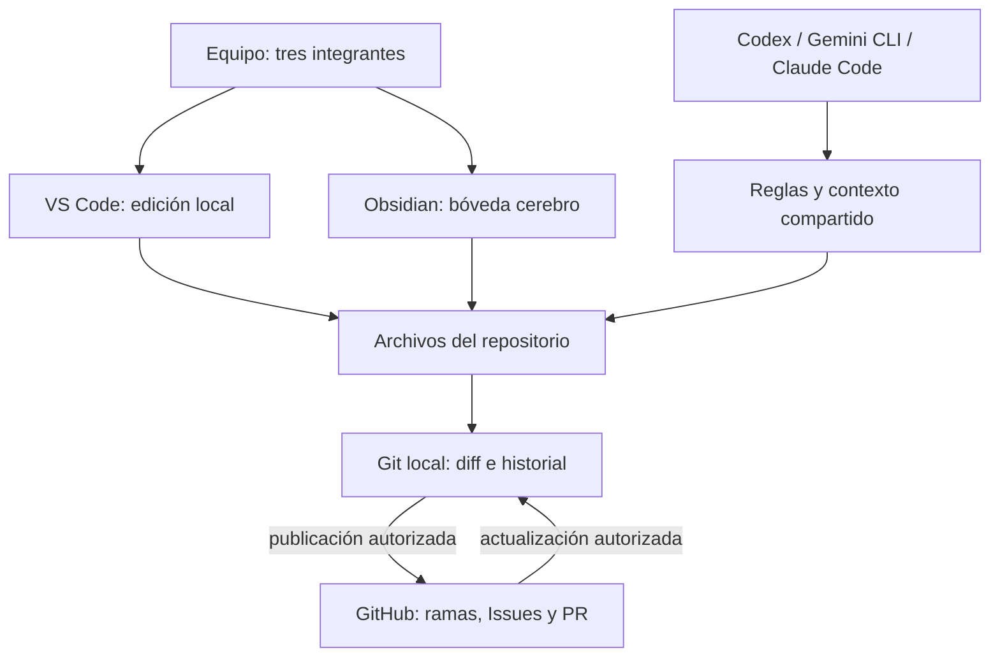
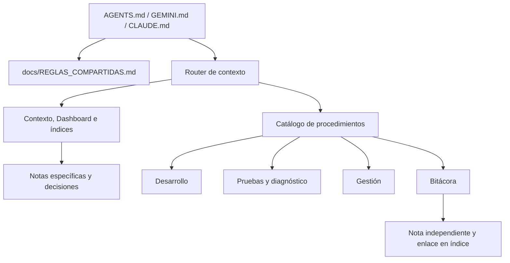

# Arquitectura del entorno colaborativo

Este capítulo describe colaboración y documentación, no la arquitectura técnica de inspección PCB. La estructura está comprobada en el repositorio al 2026-10-09; el uso operativo de cada herramienta por cada integrante requiere verificación individual.

## Piezas y responsabilidades

Git administra versiones localmente. GitHub aloja y coordina copias compartidas, Issues y revisión mediante PR. VS Code edita archivos del repositorio. Obsidian muestra los Markdown de cerebro/ como una bóveda. Los asistentes leen contexto y ayudan a producir cambios dentro de sus permisos; no son la fuente de verdad de las decisiones del equipo.

Las flechas representan relaciones previstas. No implican sincronización automática, conexión actual ni permisos ya configurados en GitHub.

## Capas de instrucciones

Los archivos de entrada son adaptaciones breves. Las reglas centrales evitan tres políticas distintas; los procedimientos evitan repetir pasos extensos. El router limita lectura a lo relevante. Los manuales explican fundamentos y reconstrucción, pero no deben duplicar cada norma del procedimiento.

## Fuentes de verdad

| Información | Lugar principal |
| --- | --- |
| Restricciones y obligaciones comunes | docs/REGLAS_COMPARTIDAS.md y alcance explícito de la tarea |
| Cómo ejecutar una tarea | docs/colaboracion/ y docs/skills/ |
| Contexto duradero y acuerdos | cerebro/01_Proyecto/ y cerebro/04_Decisiones/ |
| Trabajo realizado y evidencia | cerebro/03_Bitacora/; diff e historial Git |
| Trabajo accionable | Issues cuando existan y estén autorizados |
| Revisión de un cambio | PR cuando exista; evidencia enlazada en notas |

Una decisión aprobada requiere fuente de aprobación; una propuesta en un manual no cumple esa condición. No usar la IA como único respaldo de un acuerdo. Git registra contenido, pero puede contener documentación incorrecta: contrastar con evidencia.

## Límites y conflictos

Obsidian y VS Code pueden editar el mismo archivo. Git no impide que dos procesos escriban simultáneamente en un mismo directorio. Se recomiendan ramas por tarea en espacios separados y coordinación de índices/Dashboard. Las notas independientes reducen choques, pero nombres únicos no garantizan bloqueo.

La configuración personal `.obsidian/` y `.vscode/` está ignorada. Por eso clonar notas no reproduce automáticamente preferencias, extensiones, permisos o cuentas. No publicar credenciales en instrucciones.

Para reconstrucción, conservar versiones conocidas, criterios de aceptación y estado de cada herramienta, sin fijar dependencias de Python inexistentes. Relacionado: [[08_Manuales/04_GUIA_OBSIDIAN|Bóveda]], [[08_Manuales/05_GUIA_CODEX_GEMINI_CLAUDE|Asistentes]] y [[08_Manuales/07_INSTALACION_DESDE_CERO|Instalación]].
